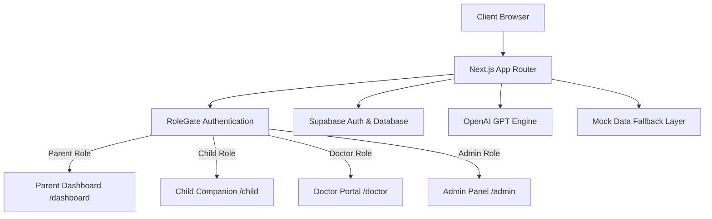

# 🛡️ KiddoAI — AI-Powered Digital Parenting & Child Wellbeing Platform

> **KiddoAI** is an advanced, full-stack AI platform designed to safeguard children in the digital age, empower parents with actionable wellbeing insights, and connect families with pediatric healthcare specialists.

---

[](https://nextjs.org/)
[](https://react.dev/)
[](https://www.typescriptlang.org/)
[](https://tailwindcss.com/)
[](https://supabase.com/)
[](https://openai.com/)
[](LICENSE)

---

## 📌 Table of Contents

- [Features & Role Portals](#-features--role-portals)
- [Architecture & Core Concepts](#-architecture--core-concepts)
- [Tech Stack](#-tech-stack)
- [Directory Structure](#-directory-structure)
- [Getting Started](#-getting-started)
- [Environment Variables](#-environment-variables)
- [Database Setup](#-database-setup)
- [API Routes](#-api-routes)
- [Authentication & Role Gate](#-authentication--role-gate)
- [Roadmap & Future Enhancements](#-roadmap--future-enhancements)
- [License](#-license)

---

## ✨ Features & Role Portals

KiddoAI is built with a multi-role architecture tailored for parents, children, pediatric doctors, and system administrators.

### 👨‍👩‍👧‍👦 1. Parent Dashboard (`/dashboard`)
- **Child Wellbeing Score**: Real-time 0–100 overall wellbeing score calculated across screen time, mood logs, and app usage patterns.
- **Screen Time Analytics (`/dashboard/screen-time`)**: Visual breakdown of gaming, social media, educational, and entertainment screen time using Recharts.
- **App Usage Monitoring (`/dashboard/app-usage`)**: Detailed per-app usage time tracking and category classification.
- **Mood Journal (`/dashboard/mood`)**: Daily emotional trend tracking with sentiment analytics.
- **Live Location & Safety Timeline (`/dashboard/location`)**: Interactive map view and location timeline (school arrivals, home check-ins, geofence alerts).
- **AI Risk Alerts (`/dashboard/alerts`)**: Intelligent threat detection flagging cyberbullying, late-night screen usage, and abrupt mood drops with confidence scores and recommended parental actions.
- **AI Parenting Assistant (`/dashboard/assistant`)**: 24/7 AI-powered advisor for parenting strategies, behavioral guidance, and child psychology questions powered by OpenAI.
- **Doctor Consultation Directory (`/dashboard/doctors`)**: Searchable list of verified pediatricians and child psychologists with appointment booking.
- **Parenting Video Library (`/dashboard/videos`)**: Streaming educational content, digital safety masterclasses, and pediatric expert videos with interactive search and category filtering.
- **Referral Network (`/dashboard/referrals`)**: Invite friends, earn family reward points, and unlock premium features.

### 🧒 2. Child Interactive Companion (`/child`)
- **Animated AI Companion**: Friendly, supportive AI coach avatar designed for positive behavioral reinforcement.
- **Daily Mood Check-in**: Emoji-based emotional check-in system with instant encouraging feedback.
- **Gamified Rewards & Streaks**: Earn points, build wellness streaks, and unlock healthy digital habits.
- **Child AI Coach Chat**: Age-appropriate, safe chat interface providing homework help, emotional support, and healthy habit suggestions.

### 🩺 3. Doctor & Specialist Portal (`/doctor`)
- **Clinical Patient Roster**: View assigned child profiles and historical wellbeing scores.
- **Risk Event Consultations**: Review flagged behavioral risk events shared by parents prior to consultations.
- **Consultation Notes & Telehealth**: Record medical notes and monitor long-term developmental progress.

### ⚙️ 4. Admin Control Panel (`/admin`)
- **System Overview**: Platform-wide user metrics, active sessions, and database connectivity status.
- **Role Distribution**: High-level telemetry for Parent, Child, Doctor, and Admin accounts.
- **Integration Management**: Module status indicators for Supabase Auth, OpenAI API, Google Maps, and Vercel Cron.

---

## 🏗️ Architecture & Core Concepts

KiddoAI combines real-time authentication, client-side offline fallbacks, safe AI system prompts, and structured database models.



### Key Highlights:
1. **Offline & Demo Mode Resiliency**: If Supabase or OpenAI credentials are not provided or unreachable, the system automatically falls back to robust local mock engines (`lib/mock-data.ts`), ensuring zero UI downtime.
2. **Safe AI System Prompts**: All child-facing and parent-facing AI routes use strict safety guardrails preventing unsafe content generation.
3. **Responsive Dark/Light UI**: Complete theme switching using `next-themes` and polished modern visual styles with Framer Motion animations.

---

## 🛠️ Tech Stack

| Component | Technology | Description |
| :--- | :--- | :--- |
| **Framework** | [Next.js 15+](https://nextjs.org/) | App Router, React Server & Client Components, Turbopack |
| **Language** | [TypeScript](https://www.typescriptlang.org/) | Strict type definitions across pages, APIs, and models |
| **UI Styling** | [Tailwind CSS v4](https://tailwindcss.com/) | Modern utility-first styling with Glassmorphism effects |
| **Animations** | [Framer Motion](https://www.framer.com/motion/) | Smooth UI transitions, page animations, and floating widgets |
| **Data Viz** | [Recharts](https://recharts.org/) | Responsive bar, line, and radar charts for wellbeing metrics |
| **Authentication**| [Supabase Auth](https://supabase.com/auth) | Google OAuth 1-click login, Email/Password, RLS security |
| **Database ORM** | [Prisma](https://www.prisma.io/) / Supabase SQL | PostgreSQL schema definition & Supabase profile trigger |
| **AI Integration**| [OpenAI API](https://platform.openai.com/) | GPT-4o-mini powered parental assistant & child companion |
| **Icons** | [Lucide React](https://lucide.dev/) | Clean, accessible SVG icon set |

---

## 📁 Directory Structure

```text
Kiddo-Ai/
├── app/                        # Next.js App Router pages & API routes
│   ├── admin/                  # Admin control panel page
│   ├── api/                    # Backend API endpoints
│   │   ├── assistant/          # Parent AI Assistant route (POST)
│   │   ├── child-coach/        # Child AI Coach route (POST)
│   │   ├── risk-summary/       # AI Risk Generator route (POST)
│   │   └── videos/             # Video streaming API route (GET)
│   ├── auth/                   # OAuth redirect callbacks
│   │   └── callback/
│   ├── child/                  # Child interactive companion page
│   ├── dashboard/              # Parent Dashboard routes
│   │   ├── alerts/             # AI Risk Alerts page
│   │   ├── app-usage/          # Detailed App Usage analytics
│   │   ├── assistant/          # Parent AI Assistant page
│   │   ├── doctors/            # Pediatric Doctor directory
│   │   ├── location/           # Live GPS timeline page
│   │   ├── mood/               # Mood journal page
│   │   ├── referrals/          # Referral rewards program
│   │   ├── screen-time/        # Screen time control page
│   │   └── videos/             # Parenting video streaming page
│   ├── doctor/                 # Healthcare provider portal page
│   ├── signin/                 # Auth Sign In (Google OAuth + Email)
│   ├── signup/                 # Auth Sign Up page
│   ├── globals.css             # Tailwind v4 globals & custom animations
│   ├── layout.tsx              # Root layout with ThemeProvider
│   └── page.tsx                # Marketing landing page
├── components/                 # Reusable UI components
│   ├── dashboard/              # Sidebar, Topbar, Charts, Wellbeing Ring
│   ├── landing/                # Hero, Features, Testimonials sections
│   ├── role-gate.tsx           # Client-side Role verification wrapper
│   ├── theme-provider.tsx      # Dark/Light mode provider
│   └── theme-toggle.tsx        # Theme toggle button
├── lib/                        # Core utilities & services
│   ├── mock-data.ts            # In-memory mock data source
│   ├── openai.ts               # OpenAI client configuration
│   ├── role-auth.ts            # Role management helpers & storage keys
│   ├── supabase.ts             # Supabase client & Auth helper functions
│   └── utils.ts                # Tailwind class mergers (cn)
├── prisma/                     # Database ORM definition
│   └── schema.prisma           # Complete PostgreSQL Prisma schema
├── public/                     # Static media, images, and video thumbnails
├── supabase/                   # Supabase database setup scripts
│   └── schema.sql              # Profiles table & RLS policies script
├── package.json                # Project dependencies & scripts
├── README.md                   # Project documentation
└── tsconfig.json               # TypeScript compiler config
```

---

## 🚀 Getting Started

### Prerequisites

Ensure you have the following installed locally:
- **Node.js**: v18.18.0 or higher
- **npm** (v9+) or **yarn** or **pnpm** or **bun**

### 1. Clone & Install Dependencies

```bash
git clone https://github.com/your-username/Kiddo-Ai.git
cd Kiddo-Ai
npm install
```

### 2. Configure Environment Variables

Create a `.env.local` file in the root directory:

```bash
cp .env.example .env.local
```

Fill in your configuration keys (or leave them empty to run in **Demo Mode**):

```env
# OpenAI API Key (Required for live AI chat, otherwise mock responses are used)
OPENAI_API_KEY=sk-proj-xxxxxx

# Supabase Auth & Database Configuration
NEXT_PUBLIC_SUPABASE_URL=https://your-project.supabase.co
NEXT_PUBLIC_SUPABASE_ANON_KEY=eyJhbGciOiJIUzI...

# Google Maps Key (Optional: for live location map rendering)
NEXT_PUBLIC_GOOGLE_MAPS_API_KEY=AIzaSyxxxxxx
```

### 3. Run Development Server

```bash
npm run dev
```

Open [http://localhost:3000](http://localhost:3000) in your browser.

- Landing Page: `/`
- Sign In: `/signin`
- Parent Dashboard: `/dashboard`
- Child Companion: `/child`
- Doctor Portal: `/doctor`
- Admin Panel: `/admin`

---

## 🔑 Environment Variables

| Variable | Required | Description |
| :--- | :--- | :--- |
| `OPENAI_API_KEY` | Optional | Key for real-time OpenAI responses in AI Assistant and Child Coach. |
| `NEXT_PUBLIC_SUPABASE_URL` | Optional | Your Supabase project URL for Auth and Profiles table. |
| `NEXT_PUBLIC_SUPABASE_ANON_KEY` | Optional | Public anonymous API key for client-side Supabase requests. |
| `NEXT_PUBLIC_GOOGLE_MAPS_API_KEY` | Optional | Google Maps JavaScript API key for live GPS tracking. |

---

## 🗄️ Database Setup

### Option A: Supabase (Recommended for Auth & Profiles)

1. Open your **Supabase Dashboard** -> **SQL Editor**.
2. Run the script located in [`supabase/schema.sql`](file:///Users/bipasasaha/Desktop/Kiddo-Ai/supabase/schema.sql):
   - Creates the `public.profiles` table linked to `auth.users`.
   - Enables Row Level Security (RLS).
   - Adds an automated trigger (`handle_new_user`) to sync new signups automatically.

### Option B: Prisma (PostgreSQL Production ORM)

For custom database instances, use the schema provided in [`prisma/schema.prisma`](file:///Users/bipasasaha/Desktop/Kiddo-Ai/prisma/schema.prisma):

```bash
npm install prisma @prisma/client
npx prisma migrate dev --name init
npx prisma studio
```

---

## 📡 API Routes

| Endpoint | Method | Description |
| :--- | :--- | :--- |
| `/api/assistant` | `POST` | Accepts `{ message, history }`. Returns AI parent advisory response. |
| `/api/child-coach` | `POST` | Accepts `{ message, mood }`. Returns child-safe companion advice. |
| `/api/risk-summary` | `POST` | Generates weekly behavioral risk summaries based on child metrics. |
| `/api/videos` | `GET` | Returns list of curated parenting masterclasses and educational videos. |

---

## 🔒 Authentication & Role Gate

KiddoAI uses a unified auth controller in [`lib/supabase.ts`](file:///Users/bipasasaha/Desktop/Kiddo-Ai/lib/supabase.ts) and a client protection wrapper [`components/role-gate.tsx`](file:///Users/bipasasaha/Desktop/Kiddo-Ai/components/role-gate.tsx).

- **Google OAuth 1-Click Login**: Instant sign-in supporting role persistence.
- **Email & Password**: Full authentication synced with Supabase `auth.users`.
- **Demo Mode**: Instant 1-click preview access for quick testing without needing an active database connection.
- **Role Redirection**:

```typescript
export const roleDashboardHref: Record<UserRole, string> = {
  parent: "/dashboard",
  doctor: "/doctor",
  child: "/child",
  admin: "/admin",
};
```

---

## 🛣️ Roadmap & Future Enhancements

- [x] **Full Parent Dashboard & Analytics Suite**
- [x] **Interactive Child Companion & Gamification Engine**
- [x] **Pediatric Doctor Portal & Risk Overview**
- [x] **Supabase Auth + Google OAuth & Local Fallback Layer**
- [x] **Parenting Video Streaming Platform**
- [ ] **Live WebSockets for Real-Time Device Monitoring**
- [ ] **Native Mobile App (React Native / iOS & Android)**
- [ ] **Stripe Subscription Billing Integration**

---

## 📄 License

This project is open-source software licensed under the [MIT License](LICENSE).
